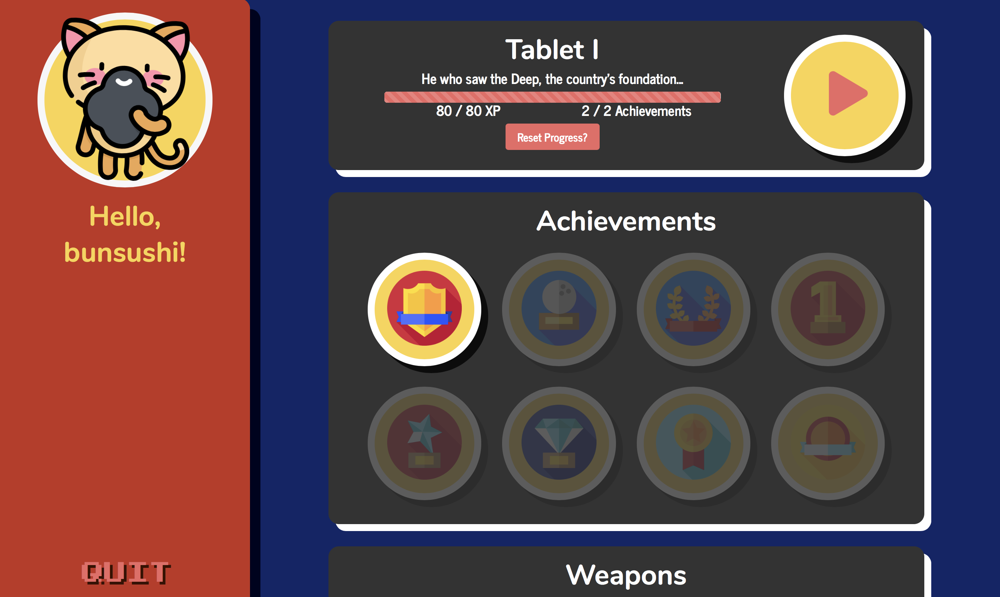

# Gilgamesh Versus
Gilgamesh Versus is a single-player role playing game (RPG) loosely adapted from the ancient Mesopotamian story _The Epic of Gilgamesh_. Play as Gilgamesh, rule the city of Uruk, fight demons and gods with your best friend, and contemplate the meaning of life.

Gilgamesh Versus has eleven levels, each corresponding roughly to the story as written in the first eleven tablets of the standard Babylonian version of the epic.


## Tablet I: "He who saw the deep..."

Tablet I of Gilgamesh Versus comprises the first level, which is broken into three parts:

### 1) Introduction to Gilgamesh
The first level is a side-scrolling platform game (similar to Mario), which serves as an introduction to the misdeeds of the king of Uruk, Gilgamesh. As Gilgamesh, you're a real "Prince John" who robs the poor to enrich yourself. In this level, you must collect coins and find a mace to rob the citizens of Uruk while avoiding dangerous flies (Mesopotamian gods) and water hazards.


### 2) The city of Uruk and mini-games
As punishment for Gilgamesh's bad behavior, the gods send the wild man Enkidu to stop Gilgamesh from oppressing his people. Gilgamesh must now explore the top-down city map of Uruk and solve a series of mini-games in order to gain the keys to the city gates and prepare for battle against Enkidu. These mini-games include: 
* learning how to brew beer (at the city brewery) 
* learning base-60 math (at the city farm) 
* learning some basic Sumerian (at the ziggurat)

### 3) Finding the city gate
After the player has completed all of the mini-games within the top-down city of Uruk, Gilgamesh must find the city gate and solve a simple puzzle or riddle. Once he has solved this, Tablet I of the game ends...who will he find on the other side of the gate?

## Development

Gilgamesh Versus is built with Phaser 3, React, Express, Node, and MongoDB + Mongoose. Gameplay is developed in Phaser, which is stored in a single React component and targets a canvas tag.

Gilgamesh uses the authentication middleware Passport to securely store salted and hashed user passwords. User menu pages and game levels are protected routes.


The Menu page displays player achievements and progress and serves as the portal to gameplay. Players can earn two categories of achievements: weapons, which are collected in a level, and badges, which are earned by completing a certain task, e.g. reaching a point threshold or finishing under a certain time. Achievements and their associated information are rendered from a simple JSON object and a method within the React component checks against the database with a client-side API whether an achievement has been earned by an individual player.



The project is regularly deployed on Heroku at http://gilgameshversus.herokuapp.com. For the most recent release version, the project is deployed on AWS at http://gilgamesh-versus.us-east-1.elasticbeanstalk.com.

## Run Locally

To run the game on your own machine, you must have yarn installed. Clone this repository and in the root directory, run ```yarn install```. Then run ```yarn start``` to spin up the React development server. Have fun!